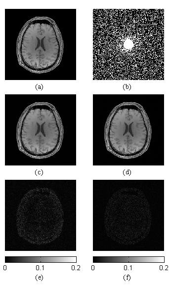

# MCTV-Image-Reconstruction
This is the source code for "Convex MR brain image reconstruction via non‐convex total variation minimization".

## Paper
Liu, Y., Du, H., Wang, Z. & Mei, W.  **Convex MR brain image reconstruction via non-convex total variation minimization**.

*International Journal of Imaging Systems and Technology* (2018).

doi: 10.1002/ima.22275

url: <https://onlinelibrary.wiley.com/doi/abs/10.1002/ima.22275>

## Prerequisite

- MATLAB R2014a or newer version

## Usage
- For demonstration, simply clone the repository and run `main.m`. Reconstruction results of TV and MCTV as well as error images are drawn. Below is one demo figure: (a) original brain image; (b) random template with 30% sampling rate and 0.1 sampling radius; (c) reconstructed image using standard TV penalty; (d) reconstructed image using MCTV penalty; (e) difference between (a) and (c); (f) difference between (a) and (d).

- I offered 2 brain images and 3 sampling templates (random, radial and Cartesian) for testing. Feel free to modify different parts of comments in `main.m` to switch and try. Of course, the optimized parameter values of different images and templates may vary.

- Furthermore, you can tailor sampling rates and methods via functions in `masks`. There is also a `README.md` inside to help you.

- For more algorithm details, please see `rec_tv.m` and `rec_mctv.m` or the relevant research paper.